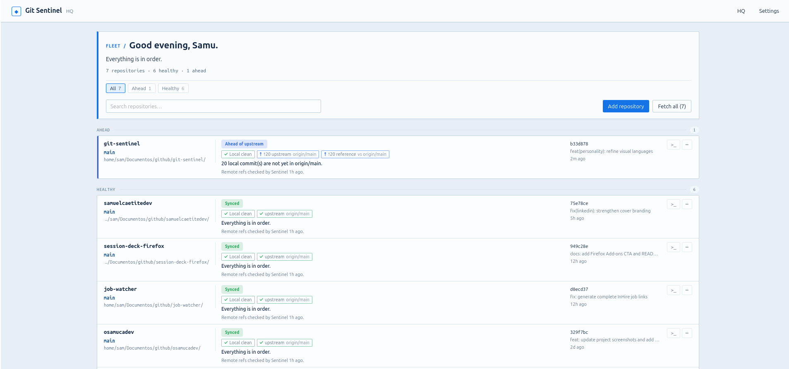
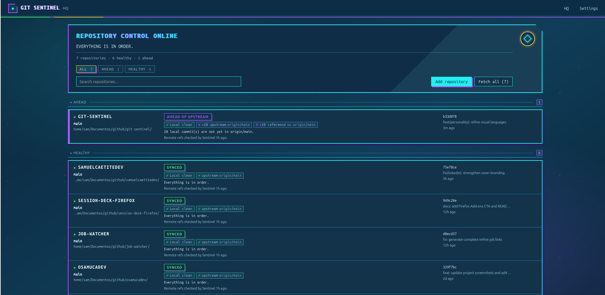
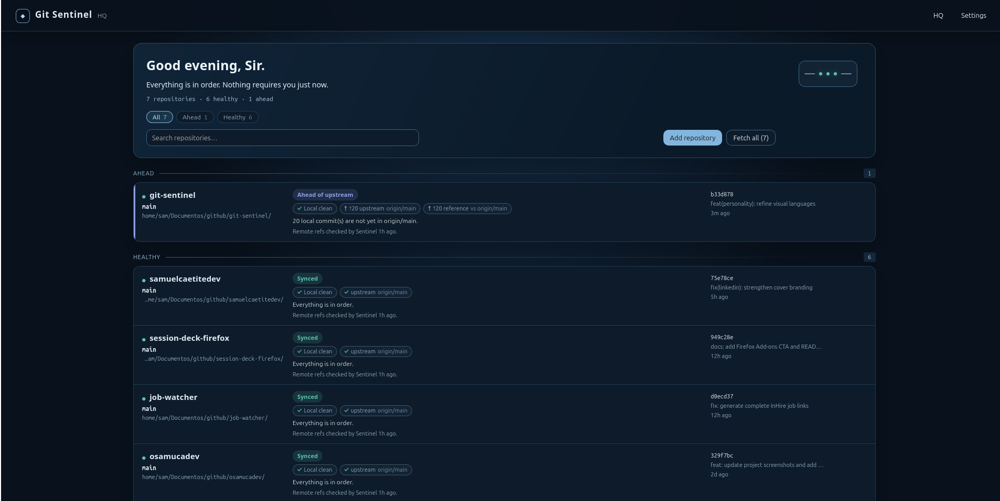
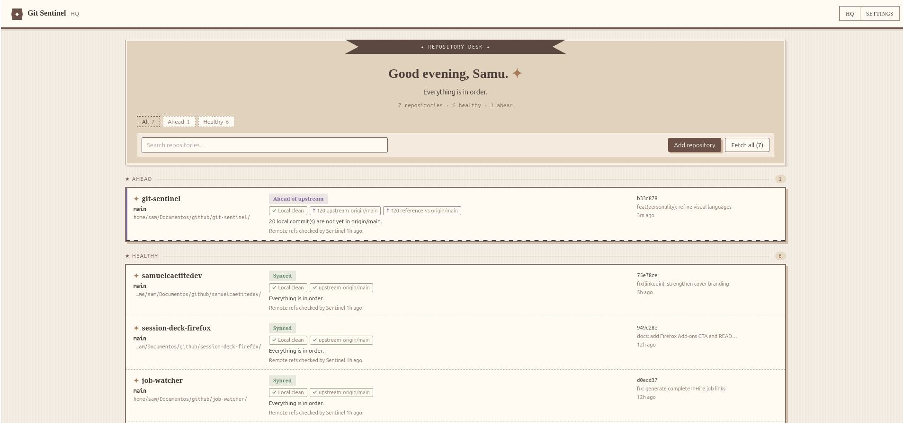
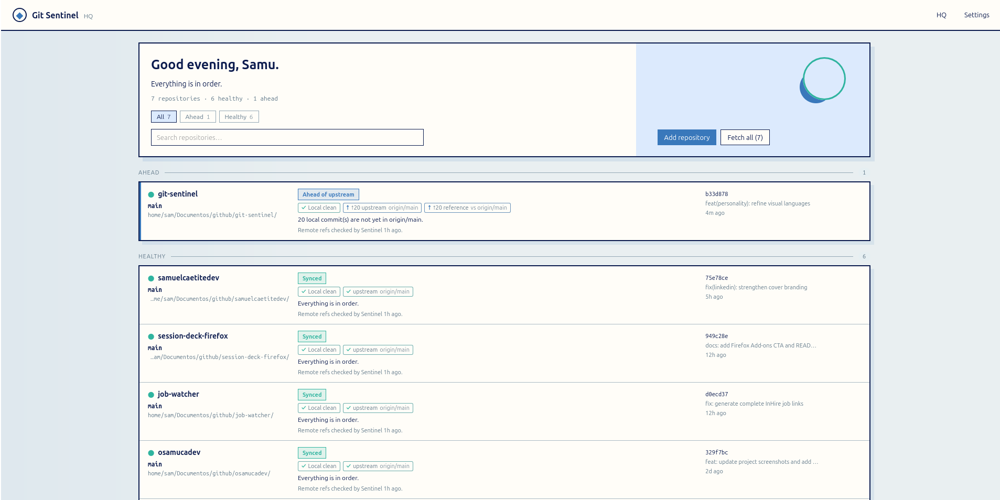
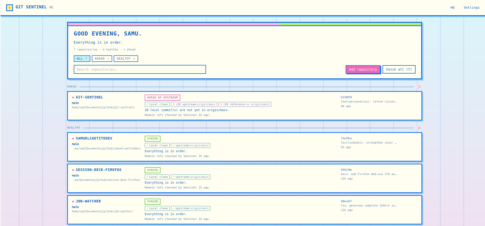
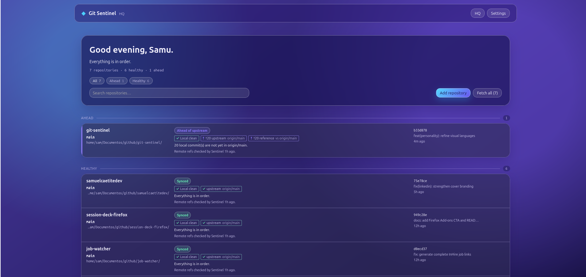

# Git Sentinel

**A local-first desktop command center for the Git repositories already on your machine.**

Git Sentinel gives developers one calm, scannable place to see what is happening across their repositories: the current branch, local work, upstream status, a project reference, and the latest commit. It is built for the moment when you have several checkouts open and need an accurate answer before you touch anything.

It observes Git. It does not take ownership of your repositories.

> **Platform status:** Git Sentinel is currently developed and supported on **Linux**. Windows and macOS are not ready yet. Contributions, ports, and forks are very welcome.

## Why Git Sentinel

- Keep a fleet of local repositories in one desktop view.
- Know which branch is checked out before working in the wrong directory.
- Separate three useful facts: **local working tree**, **branch upstream**, and **project reference**.
- Notice local Git changes automatically without polling remotes or installing hooks.
- Fetch without freezing the desktop interface.
- Use the same Git facts through eight genuinely different visual personalities.

## Gallery

| Technical | Cute |
| --- | --- |
|  |  |

| Sci-Fi | Jarbas |
| --- | --- |
|  |  |

| Retro | Line Art |
| --- | --- |
|  |  |

| Pixel Art | Modern Glass |
| --- | --- |
|  |  |

## What it does

### Headquarters

HQ groups your registered repositories by what needs attention and makes the important state visible at a glance:

- current branch and latest commit;
- local changes, staging, untracked files, and conflicts;
- ahead, behind, and diverged relationships with the branch's configured upstream;
- a separate relationship with the configured project reference branch;
- remote-tracking freshness, always described as the result of a previous fetch;
- concise human interpretation plus compact semantic signals.

Healthy repositories stay compact. Repositories with local work, divergence, conflicts, unavailable tracking, or other relevant state receive proportionally more context.

### Repository details

Open a repository to inspect its branch, working tree, upstream and reference relationships, remotes, branches, and latest activity in more detail. The details view keeps the Git topology presentation where it is useful; HQ intentionally uses semantic signals instead of a Git graph.

### Local refresh and network fetch

Git Sentinel distinguishes local inspection from network activity:

- **Refresh** re-inspects local Git state only.
- Local Git metadata changes are watched with a small Linux-first debounce, so an external commit or edit refreshes only the affected repository.
- **Fetch** and **Fetch all** update remote-tracking refs only. They never pull, push, checkout, merge, rebase, reset, or modify your working branch.
- Network work runs away from the GUI event loop and reports progress in the activity strip, keeping the application navigable and scrollable.

### Personalities and language

Choose among Technical, Cute, Sci-Fi, Jarbas, Retro, Line Art, Pixel Art, and Modern Glass. Every personality shares the exact same inspection model and product behavior; only the presentation, typography, density, and tone change.

The interface is available in English, Brazilian Portuguese, and Spanish.

## Install and run on Linux

### Prerequisites

- Git available on your `PATH`
- Node.js 18 or later
- Rust stable, installed with [rustup](https://rustup.rs)
- Tauri v2 Linux dependencies. On Debian or Ubuntu:

```bash
sudo apt install -y \
  libwebkit2gtk-4.1-dev libsoup-3.0-dev libjavascriptcoregtk-4.1-dev \
  libxdo-dev libssl-dev librsvg2-dev build-essential pkg-config file
```

### Development build

```bash
git clone <your-fork-or-clone-url>
cd git-sentinel
npm install
npm run tauri -- dev
```

### Production package

```bash
npm run tauri -- build
```

Tauri writes Linux bundles under `src-tauri/target/release/bundle/` when the host has the required packaging tools.

### Test the project

```bash
npm test
npm run test:core
npm run build
```

## Safety and privacy

Git Sentinel stores its own preferences and repository paths locally. It does not upload repository data, manage Git credentials, or sign in to Git hosting providers.

Registering a repository does not modify it. Removing one from Sentinel removes only the saved Sentinel entry, never the folder or its Git history. The app relies on the Git environment you already configured for SSH, HTTPS, credentials, and remotes.

## Current limitations

- Linux is the only supported platform today; Windows and macOS are not yet supported.
- Git Sentinel observes local repositories only. It has no cloud account, synchronization service, tray icon, desktop notifications, or automatic remote fetch.
- Remote-tracking information is a local snapshot from the most recent Sentinel fetch. It is not proof of live remote state.
- Git Sentinel deliberately does not offer pull, push, checkout, merge, rebase, reset, branch creation, or stash actions.
- Terminal launching depends on a compatible terminal emulator being available on the system.

## Contributing and forks

Git Sentinel is intentionally friendly to experimentation. Please feel free to open an issue, submit a pull request, create a platform port, or make your own copy. The project is available under the permissive [MIT License](LICENSE).

For a fuller product and technical guide, see:

- [English documentation](docs/README.en.md)
- [Documentação em português do Brasil](docs/README.pt-BR.md)
- [Documentación en español](docs/README.es.md)
